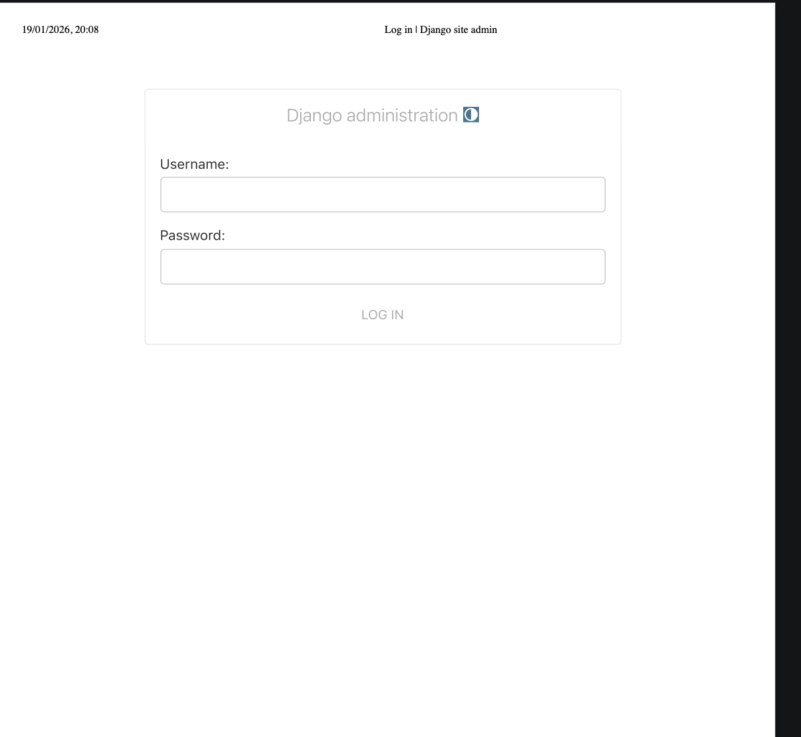
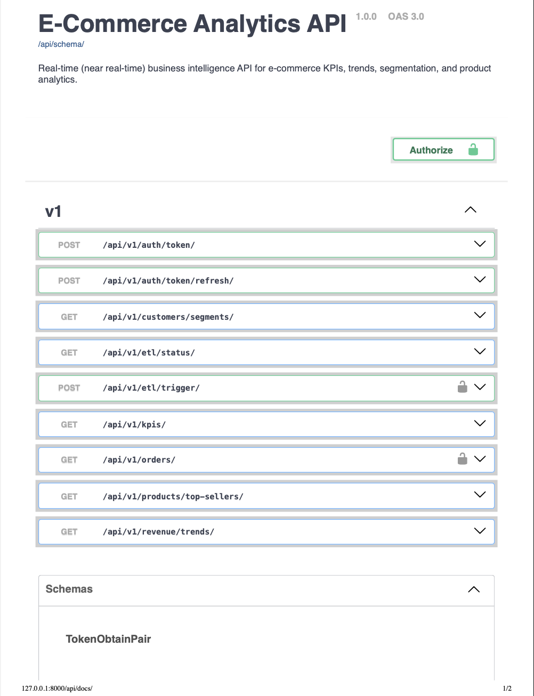
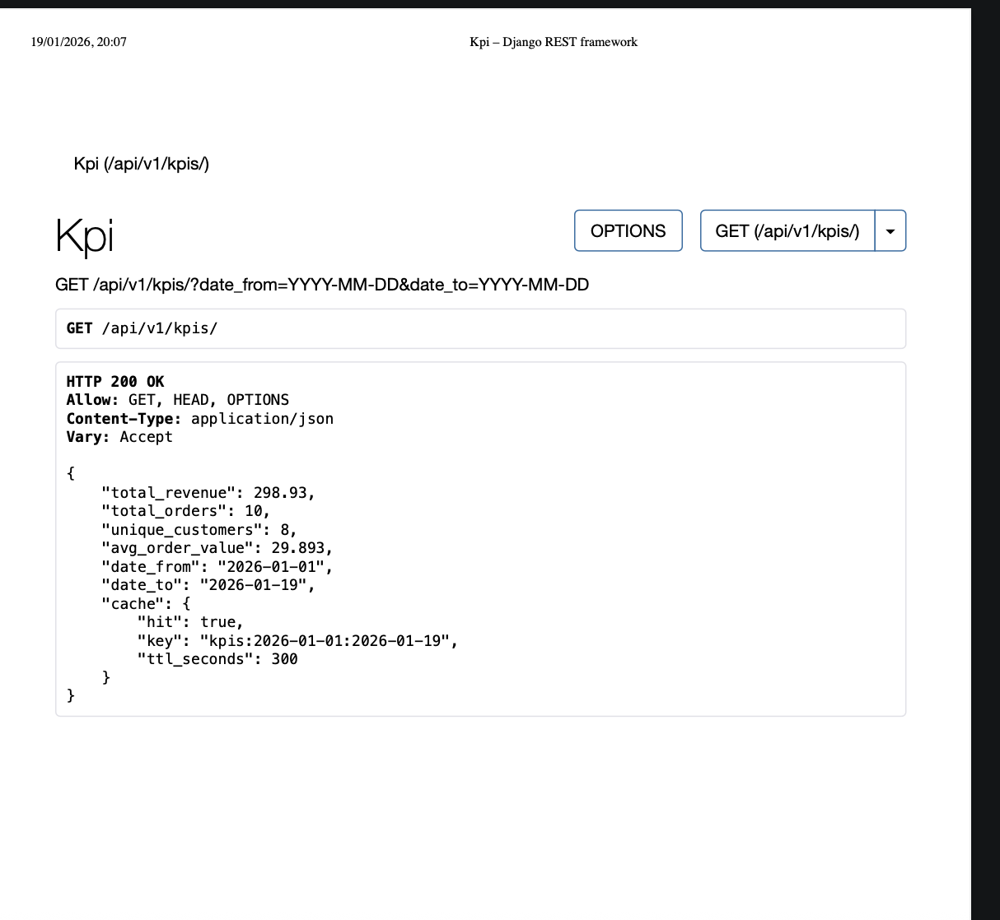

# Real Time  E-Commerce Analytics Platform

A production ready, full stack analytics system for  E-Commerce, designed to demonstrate real world data engineering, backend development, and business intelligence workflows.

Live Demo: (add after deployment)  
API Docs: /api/docs/  
Dockerized | API Driven | Analytics Focused

 

## Overview

This project simulates how real companies design and operate analytics platforms, covering the entire data life cycle:

  Data ingestion via ETL pipelines  
  Data warehouse modeling  
  SQL based analytics and KPIs  
  RESTful API exposure  
  Interactive BI dashboard  

The focus is on scalability, clarity, and production ready architecture.

   

##  Architecture


Raw Data (CSV / API)
         ↓
ETL Pipeline (Celery + Pandas)
         ↓
PostgreSQL Data Warehouse (Star Schema)
         ↓
Django REST Analytics API
         ↓
Dash (Plotly) Dashboard


---

## Tech Stack

**Backend & Data**
- Python
- Django + Django REST Framework
- PostgreSQL
- Advanced SQL (CTEs, window functions)
- JWT Authentication

**ETL & Analytics**
- Pandas / NumPy
- Celery + Redis
- ETL audit logging & monitoring

**Dashboard**
- Dash + Plotly
- Real-time KPIs & charts
- Secure API-driven data access

**DevOps**
- Docker & Docker Compose
- Environment-based configuration

---

##  Key Features

### Data Warehouse
- Star schema (fact & dimension tables)
- Optimized for time-based analytics
- Scalable schema design

### ETL Pipeline
- Automated background jobs
- Data validation & retry logic
- Full ETL audit trail (status, rows, execution time)



---

### Analytics API
- KPIs, revenue trends, top products
- Customer RFM segmentation
- JWT-protected endpoints
- OpenAPI / Swagger documentation





---

### Interactive Dashboard
- Real-time KPI cards
- Revenue & product analytics
- Customer segmentation visualization
- Auto-refresh & graceful error handling


---

##  Run Locally

```bash
# Backend
cd backend
python manage.py runserver

# Dashboard
python -m dashboard.app

```

Dashboard: http://127.0.0.1:8050

API Docs: http://127.0.0.1:8000/api/docs/


